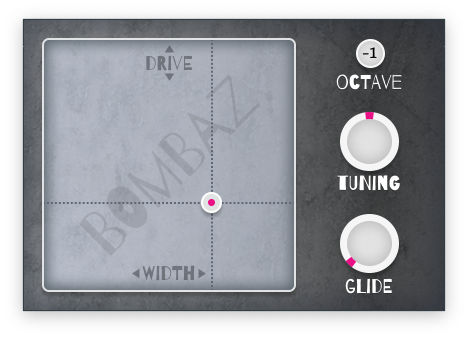

# Bombaz

Monophonic bass synth VST/AU plug-in based on Window Function synthesis. Useful for adding sub-bass layers.



How to use this plug-in:

- **WIDTH + DRIVE** The XY pad sets the tone. Moving from left to right changes the pulse width. Moving up increases the drive, which adds more harmonics.

- **OCTAVE** Transposes the sound by –2, –1, or 0 octaves.

- **TUNING** Additional fine-tuning, from –100 to +100 cents.

- **GLIDE** Enables a portamento effect.

<!-- [Read more about how this plug-in works on my blog](https://audiodev.blog/bombaz/) -->

## Installation instructions

Download the latest version from the [Releases page](https://github.com/hollance/bombaz/releases).

Extract the downloaded ZIP file.

On Mac:

- copy **Bombaz.component** to the folder **/Library/Audio/Plug-Ins/Components**
- copy **Bombaz.vst3** to the folder **/Library/Audio/Plug-Ins/VST3**

On Windows:

- copy **Bombaz.vst3** to the folder **C:\Program Files\Common Files\VST3**

In your DAW, look for **audiodev.blog > Bombaz**. This is an instrument plug-in.

## How to build the plug-in

Bombaz is written using JUCE 8.

This project uses CMake. It assumes a global installation of JUCE.

On macOS:

```bash
cmake -B build -G Xcode -D"CMAKE_OSX_ARCHITECTURES=arm64;x86_64"
```

Then open **build/Bombaz.xcodeproj** in Xcode and build the VST3 and/or AU targets.

On Windows:

```text
cmake -B build -G "Visual Studio 17 2022" -DCMAKE_INSTALL_PREFIX=\path\to\JUCE\cmake\install
```

Then open **build/Bombaz.sln** in Visual Studio and build the VST3 project.

## Credits & license

Copyright (C) 2022-2024 M.I. Hollemans

This program is free software: you can redistribute it and/or modify it under the terms of the [GNU General Public License](https://www.gnu.org/licenses/gpl-3.0.en.html) as published by the Free Software Foundation, either version 3 of the License, or (at your option) any later version.

JUCE is copyright © Raw Material Software.

VST® is a trademark of Steinberg Media Technologies GmbH, registered in Europe and other countries.
